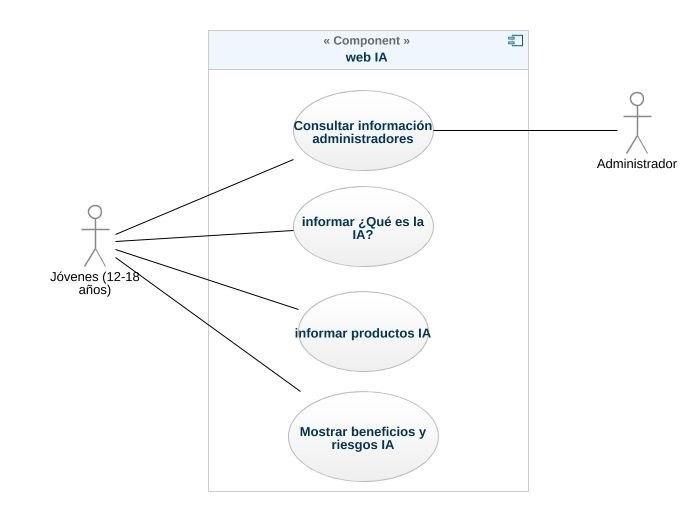

## Casos de uso

**CU01:** Probar el video interactivo

**Descripción:** El usuario introduce un nombre de usuario y se guarda temporalmente en el sistema.

**Secuencia:**
1. El usuario ingresa a la pagina web
2. El usuario seleciona la opcion "Probar Video Interactivo"
3. El usuario introduce su username 

**Salidas alternas:**  Si el usuario no introduce un nombre de usuario valido, el sistema mostrará un mensaje de error.

------------
**CU02:** Responder a una pregunta del video interactivo

**Descripción:** El usuario responde a la pregunta planteada en el video interactivo y debe selecionar una respuesta en menos de 10 segundos.

**Secuencia:**
1. El usuario reproduce el video
2. El usuario termina con la reproducción de un video
3. El usuario responde la pregunta planteada
4. El usuario es redireccionado al siguiente video.

**Salidas alternativas:**  Si el usuario responde de manera incorrecta, puede repetir el video. Si el usuario no responde en 10 segundos, la respuesta se toma como inválida.

------------
**CU03:** Detener el video

**Descripción:** El usuario debe parar la reproducción del video

**Secuencia:**
1. El usuario toca el icono de "Stop" en el reproducto.

**Salidas alternativas:**  El usuario da click en el icono "Play" para continuar la reproducción.

------------

## Diagrama de Casos de Uso

***

