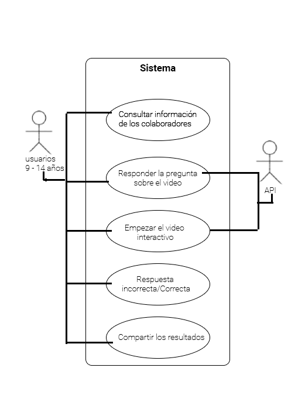

## Casos de uso

**CU01:** Invocar al bot  

**Precondición** Ninguna 

**Descripción:** El usuario requiere iniciar el bot y lanza el comando de voz para acceder a él. 

**Secuencia:**
1. El usuario invoca a Alexa 
2. El usuario le dice a Alexa "abre ingenio artificial" 
3. Alexa busca la skill ingenio artificial  
4. Alexa abre la skill ingenio artificial 

**Salidas alternas:**  Si el sistema no encuentra una coincidencia, entonces lanza las posibles sugerencias de acuerdo a lo que se intenta buscar. 

------------
**CU02:** Primera interacción  

**Precondición**  Es la primera vez, que el usuario ejecuta la skill

**Descripción:** Alexa brinda una breve introducción, para que el usuario conozca el funcionamiento del bot. 

**Secuencia:**
1. El usuario le dice a Alexa "Abre ingenio artificial" 
2. Alexa verifica que sea la primera vez que se inició la skill. 
3. Alexa muestra un mensaje de introducción sobre el funcionamiento de la skill. 
4. Alexa pregunta  "¿Entonces que quieres hacer?" 

**Salidas alternativas:**  Si no es la primera vez que se usa, entonces Alexa muestra un saludo diferente y más simple. 

------------
**CU03:** El usuario le pregunta curiosidades a Alexa  

**Precondición** Alexa no debe repetir las curiosidades que ya ha mencionado. 

**Descripción:** Alexa proporciona una respuesta superficial con respecto a la pregunta del usuario. 

**Secuencia:**
1. El usuario hace una pregunta a Alexa, ej.: "¿Los supermercados utilizan la IA" 
2. Alexa proporciona una respuesta breve, e interesante. 
3. Alexa pregunta "¿Deseas saber más al respecto?" 

**Salidas alternativas:**  Alexa emite un mensaje "¿Tienes alguna otra pregunta sobre inteligencia artificial?" 

------------
**CU04:** Alexa responde las preguntas frecuentes  

**Precondición** Solo responde las preguntas frecuentes básicas que se encuentren almacenadas en el sistema. 

**Descripción:** El usuario desea conocer la respuesta a una pregunta "Básica" relacionada con la IA, y pregunta a skill para responder su duda. 

**Secuencia:**
1. El usuario le dice Alexa "Alexa pregúntale a ingenio artificial ¿{pregunta}?" 
2. Alexa analiza la intención del usuario y verifica que exista una posible respuesta a su pregunta. 
3. Alexa responde con una respuesta precargada. 

**Salidas alternas:**  Alexa emite un mensaje "Vaya, creo que no encontré una respuesta a tu pregunta, pregúntame otra cosa." 

## Diagrama de Casos de Uso

***

